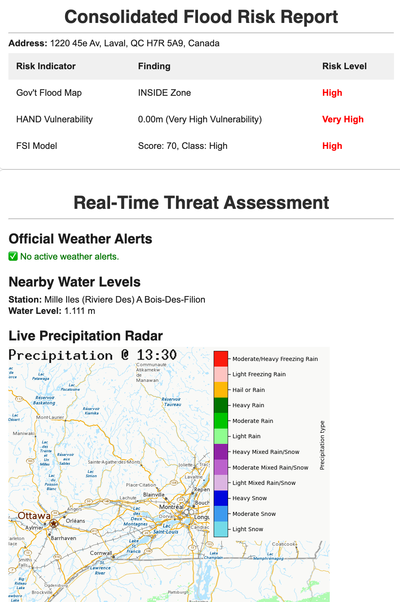

## flood-risk-analyzer
This project is a multi-layered geospatial application designed to provide a comprehensive and highly detailed flood risk assessment for any given address. Moving beyond simple map lookups, it integrates multiple independent data sources—including government flood plains, topographical vulnerability models, and federal susceptibility indexes—to create a robust, evidence-based risk profile.
The system is designed to be fully automated, culminating in a deployment as a serverless cloud function that can generate daily advisories, demonstrating a complete end-to-end data engineering and analysis workflow.

## Core Features
- **Multi-Source Risk Assessment**:
  Ingests and analyzes data from three independent sources to avoid single-point-of-failure conclusions:
  1. Official Government Flood Zone Maps (.gpkg) (In this case Quebec "Carte Geo Inondation) 
  2. Topographical Vulnerability via Height Above Nearest Drainage (HAND) model from Google Earth Engine.
  3. Modeled Flood Susceptibility Index (FSI) from the Canadian Federal Government (.tif).

- # Hyper-Local Vulnerability Analysis:
  Instead of just confirming if an address is in a flood zone, it calculates the specific vertical distance from the property to the nearest drainage channel (HAND), offering a granular view of its real-world vulnerability.

- # Real-Time Threat Monitoring:
  Once a property is assessed, the system automatically fetches live, up-to-the-minute data from Environment Canada, including:
  1. Official weather warnings and alerts.
  2. Real-time water levels and flow rates from the nearest hydrometric station.
  3. Live precipitation radar maps.
     
- # Automated Reporting & Deployment:
  The entire workflow can be packaged into a script deployed as a Google Cloud Function. It can be triggered by a scheduler to run automatically, generating a consolidated risk report and emailing it to a user via the SendGrid API.

## Output Example

## Technology Stack
Languages: Python
Core Libraries:
 - Geospatial Analysis: GeoPandas, Rasterio, Geopy
 - Cloud & APIs: earthengine-api (Google Earth Engine), env-canada, requests, google-generativeai
 - Data Handling: Pandas, Numpy
Data Formats: GeoPackage (.gpkg), GeoTIFF (.tif), JSON, XML

## Future Expansion
This project serves as a powerful foundation that can be expanded in several ways:

- # Transition to a Push-Based Alert System:
  The current automated system "pulls" for data on a schedule. The next evolution is to create a persistent service that subscribes to real-time data streams (where available) and sends notifications instantly upon receiving a new alert, rather than waiting for the next scheduled run.

- # Incorporate Advanced Meteorological Data:
  Integrate more datasets from the ECCC, such as quantitative precipitation forecasts (QPF) and watershed-specific rainfall accumulation (HRDPA), to make the alerting logic even more intelligent.

- # Batch Processing for B2B Clients:
  The core analysis function can be adapted to run on a large list of addresses (e.g., from a CSV file), making it a valuable tool for institutions like banks or insurance companies to assess flood risk across their entire mortgage or policy portfolio.

- # Develop a Web Interface:
  Create a simple web front-end using a framework like Flask or Streamlit to allow users to enter an address and view the generated risk reports interactively in their browser.

## Dataset Citation
- Géo-Inondations : Grille de présence d’information sur les zones inondables: https://geoinondations.gouv.qc.ca/
- Flood Susceptibility Index (FSI): Canada Federal Government Open Government
- Global 30m Height Above the Nearest Drainage (HAND): Donchyts, Gennadii, Hessel Winsemius, Jaap Schellekens, Tyler Erickson, Hongkai Gao, Hubert Savenije, and Nick van de Giesen.
